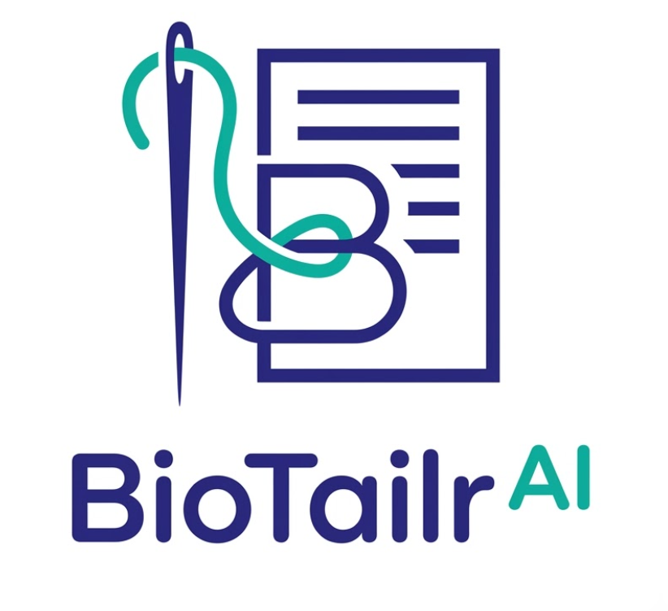

# BioTailr AI — 100% ATS Resume Tailoring Extension

<p align="center">
  
</p>

<p align="center">
  <strong>Intelligent Job Posting Scanner &amp; ATS Resume Tailoring Engine with Multi-Job Queue &amp; One-Step Download.</strong>
</p>

---

## Key Capabilities

### 1. One-Step Scan & Direct Download
- Click **SCAN & TAILOR** at the center to extract the job role, company, location, requirements, and technical skills from your active browser tab.
- Automatically processes the role through the **BioTailr AI Engine** calibrated on Sanjay N's 4 authentic career tracks.
- Guarantees **100% ATS score compliance** with quantified metrics, high-impact action verbs, and standard single-column formatting.
- Instant direct download right inside the extension:
  - **Download PDF**: Vector-rendered, strictly 1-page A4 PDF export using bundled `html2pdf.bundle.min.js`.
  - **Download HTML**: Standalone pure-black ATS-compliant HTML file.
  - **Open in BioTailr Web**: Direct bridge to the deployed web application at [`https://rns-forge.github.io/BioTailr-AI/`](https://rns-forge.github.io/BioTailr-AI/).

### 2. Multi-Job Queue ("Job Manner")
- **Concurrent Job Management**: Run and track multiple job scans simultaneously.
- While Job 1 is tailoring or ready, click **+ New Job** to switch tabs in your browser and scan Job 2 without losing your progress.
- Each job tab retains its own extracted metadata, tailored resume, download buttons, and revision history.

### 3. Interactive AI Refinement Chat (Post-Scan)
- The chat footer remains safely locked until the job scan and tailored resume are received.
- Once ready, the chat **unlocks** allowing you to request targeted revisions (e.g. *"Emphasize Kubernetes and cloud microservices"*, *"Add Docker to skills"*).
- The AI dynamically re-synthesizes the resume, re-scores ATS compliance, and generates an updated **Revision Card** with fresh download buttons.

### 4. Executive Brand Aesthetics & Zero Emojis
- Pure executive palette: Primary Navy (`#1e1b78`), Accent Teal (`#00b49f`), Neutral Slate (`#f8fafc`).
- Zero emojis throughout the entire extension interface. All badges, chips, and indicators use clean vector SVGs and official BioTailr logo animations.

---

## Installation Guide (Google Chrome & Microsoft Edge)

1. Open **Google Chrome** or **Microsoft Edge**.
2. Navigate to your browser's extensions page:
   - **Chrome**: `chrome://extensions/`
   - **Edge**: `edge://extensions/`
3. Turn on the **Developer mode** toggle in the top-right corner.
4. Click **Load unpacked** in the top-left corner.
5. Select this folder:
   ```
   C:\Temp Files\My Projects\BioTailr.ai\BioTailr-AI-Extension
   ```
6. Pin **BioTailr AI** to your browser toolbar for quick access.

---

## Workflow

1. Navigate to any job listing on **LinkedIn**, **Indeed**, **Greenhouse**, **Lever**, **Workday**, or company careers pages.
2. Click the **BioTailr AI** toolbar icon.
3. Click **SCAN & TAILOR**.
4. Within seconds, your **100% ATS-Compliant Resume** is ready. Click **Download PDF** or **Download HTML** in one step.
5. Type any custom updates in the chat to generate new revisions, or click **+ New Job** to scan another job!
